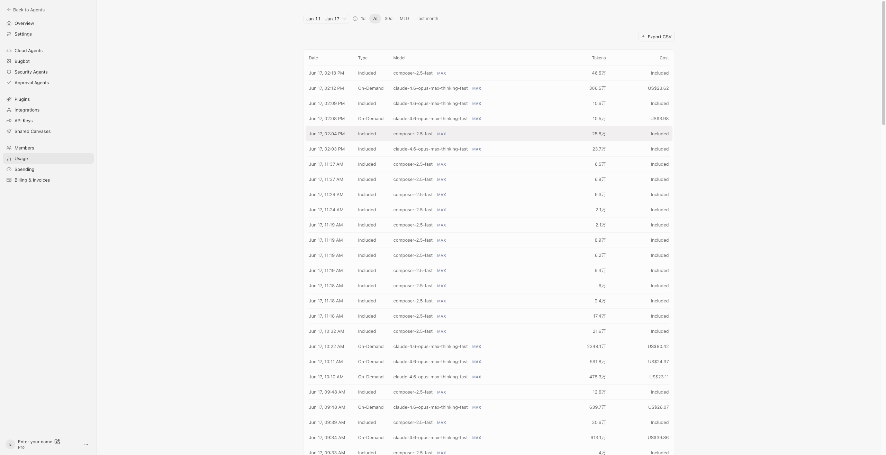
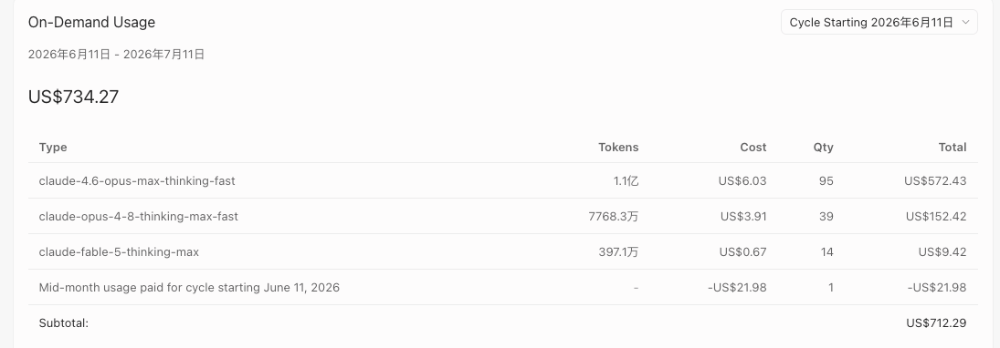
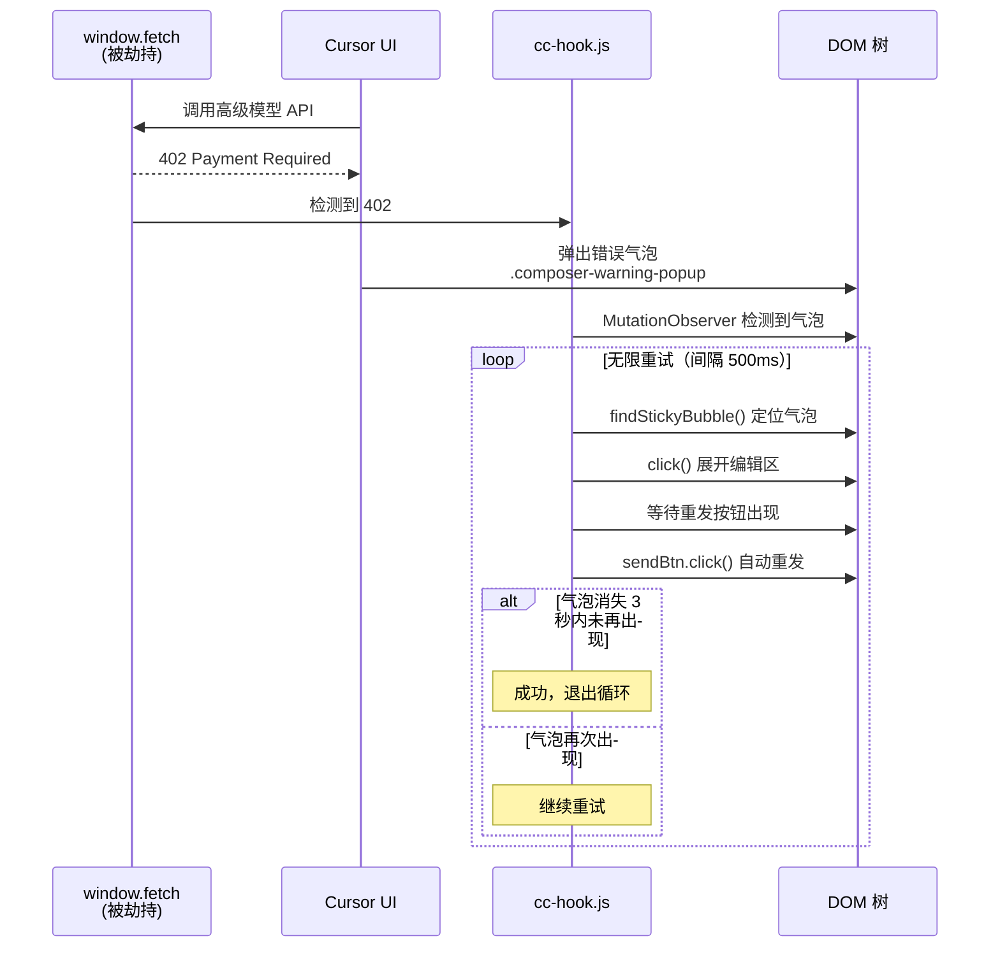
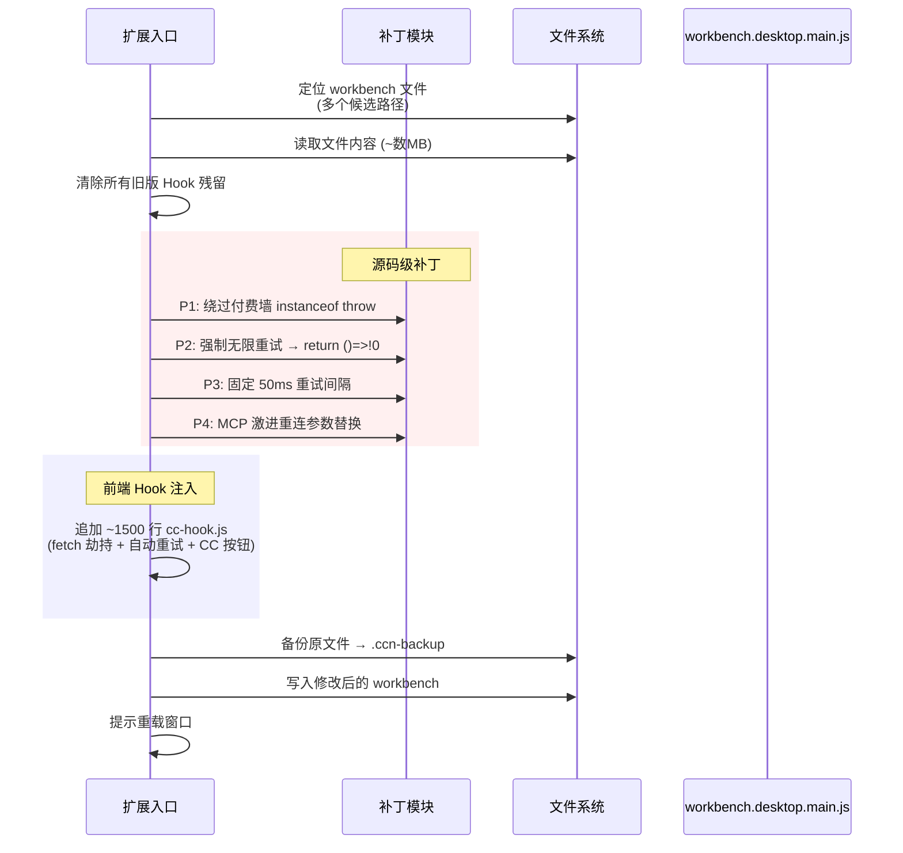
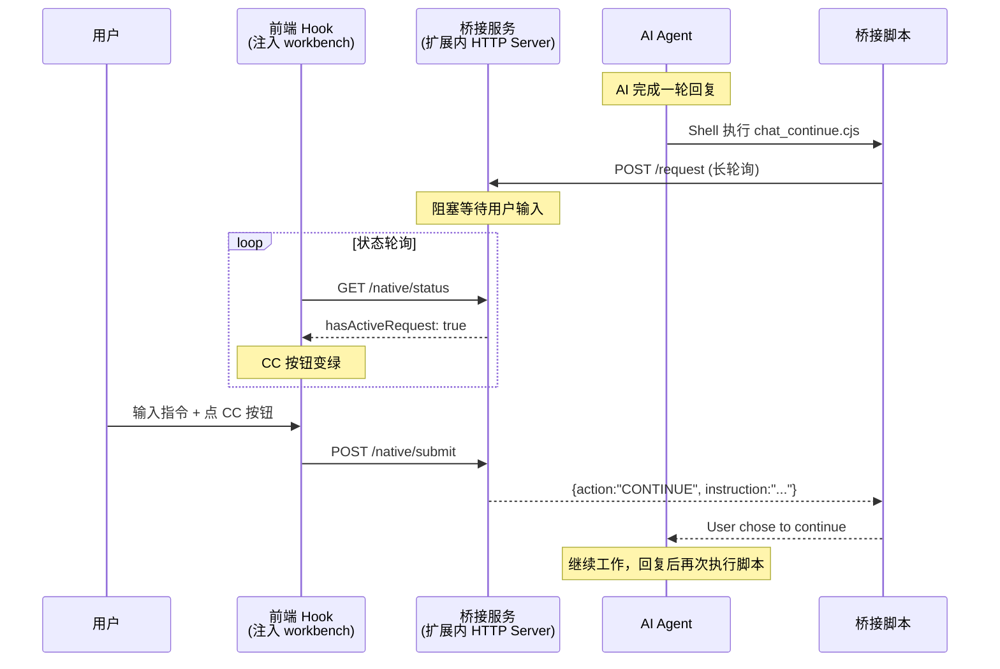
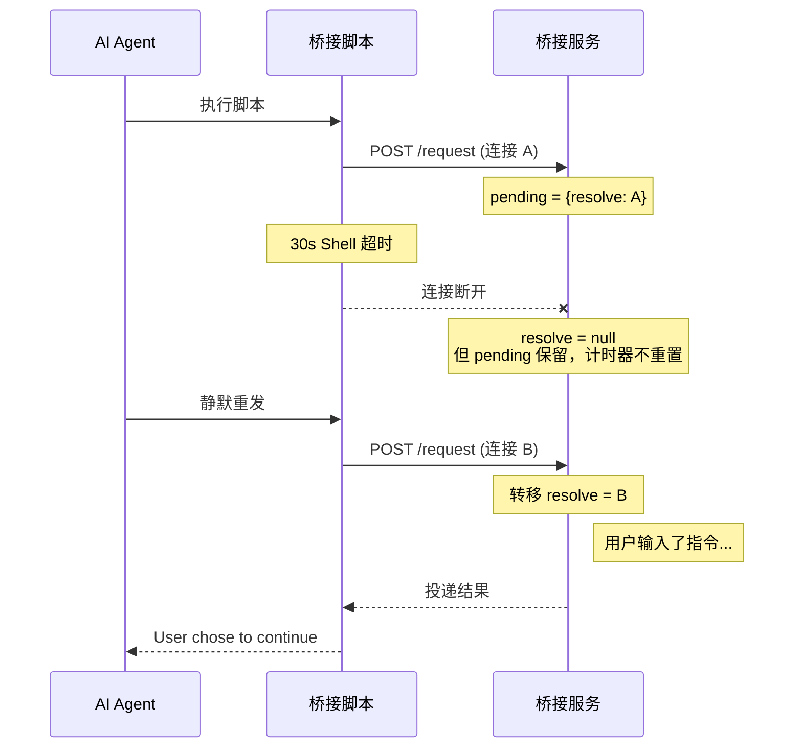

# 逆向拆解 Cursor Continue：一个绕过 Cursor 付费限制的插件是如何实现的

## 前言

> **⚠️ 免责声明**：本文仅供安全研究、逆向工程技术交流与防御机制探讨。请勿将本文涉及的技术用于任何非法牟利或破坏商业软件授权的活动。支持正版，尊重开发者的劳动成果。

Cursor 的商业模式是按 API 调用量计费，高级模型（Claude Sonnet/Opus、GPT-4 等）有严格的额度限制。用完额度后，要么升级套餐，要么等额度重置，要么接受降级到基础模型。触发限流时 Cursor 会弹出付费墙，限制你继续使用。



最近做攻防演练时，我拿到了一份叫 `Cursor Continue` 的第三方插件的 VSIX 包。逆向分析后发现，它的核心能力不只是"让 AI 持续工作"那么简单——**它直接修改了 Cursor 的源码，通过四个精准补丁绕过了付费墙弹窗、强制开启无限重试、把重试间隔压到 50ms、并让 MCP 连接在断开后激进重连**。效果是：用户可以**无视额度限制，超额使用高级模型，触发限流后自动无限重试直到成功**。



本文完整记录我的逆向过程和技术分析。

---

## 一、样本获取与静态分析：未混淆的突破口

### 原始样本

`cursorContinue_patched.vsix` 解包后：

```
extension/
├── dist/extension.js        # 158KB 混淆 bundle（javascript-obfuscator）
├── media/
│   ├── panel.js              # 68KB Webview 面板（未混淆）
│   ├── cc-hook.js            # 12KB 前端 Hook（未混淆）
│   └── panel.css
├── license-public.key        # Ed25519 公钥
└── bin/
    ├── darwin-arm64/cursor-continue-core   # 14.7MB Go 二进制
    ├── darwin-x64/...
    ├── linux-*/...
    └── win32-*/...           # 6 个平台合计 ~95MB
```

入口 `extension.js` 经过 `javascript-obfuscator v5.4.3` 重度混淆——158KB 单行、4748 个 `_0x` 开头的变量。但 `panel.js` 和 `cc-hook.js` 是**未混淆**的可读代码，这是我的突破口。

---

## 二、逆向过程：两层防护的逐层击破

这个插件有**两层授权防护**——JS 扩展层和 Go Core 二进制层。我从外到内逐层分析和突破。

### 2.1 从未混淆部分入手

混淆的 `extension.js` 一时半会啃不动，但 `panel.js`（Webview 面板）和 `cc-hook.js`（workbench 注入 Hook）都是**未混淆的可读代码**。这是突破口。

`panel.js` 是 2149 行的 Webview 前端代码，从中我提取到了完整的消息协议：

```javascript
// 面板通过 postMessage 和扩展通信
vscode.postMessage({ type: "activateCardKey", payload: { cardKey } });

// 授权状态由扩展推送
licenseState: { stage: "unknown", activated: false }

// 未激活时 UI 拦截
submit() → if !isLicenseActive() → 显示"请先完成插件激活"
enqueue() → if !isLicenseActive() → 显示"请先完成插件激活"
```

但这只是**UI 拦截**，不是安全边界——后端的 `extension.js` 和 Go Core 才是真正的授权检查点。

`cc-hook.js` 则直接暴露了插件的核心意图：Monkey-Patch `window.fetch` 检测 402、DOM 级无限重试、自动关闭 "Don't revert"——这不是什么"增强体验"，而是**系统性的计费绕过**。

### 2.2 反混淆 extension.js：攻破第一层

`extension.js` 的混淆用的是 `javascript-obfuscator v5.4.3`（从 `package.json` 的 devDependencies 确认），特征非常典型：

```javascript
// 字符串数组 + 旋转 IIFE
const _0xa9cb2d=_0x36c3;(function(_0x29e4cc,_0x41e034){
  while(!![]){try{const _0x1c18af=-parseInt(...)...
// 4748 个 _0x 开头的变量名
// 63393 字符压成单行
```

虽然整体不可读，但**字符串提取**仍然能拿到大量关键信息。我从中找到了：

**授权体系已被篡改**：

```javascript
// 反混淆后发现 getState() 被改为直接返回已激活
getState() {
  return { stage: "activated", activated: true, publicKeyConfigured: true }
}
```

不只是正常路径——**所有错误分支也返回 `activated: true`**。缺 Core、缺公钥、过期、在线验证失败，全部被包装成已激活状态。说明这份 VSIX 本身已经被人动过了。

**授权管理类的字段**（反混淆还原）：

```typescript
class LicenseManager {
  goBinaryPath: string;      // Go Core 路径
  licenseDataDir: string;    // ~/Library/Application Support/cursor_continue_go
  extensionPath: string;
  state: LicenseState;       // { stage, activated, fingerprint, licensee, expiresAt }
}
```

**激活服务器和 API**：

```
服务器: https://a8.ttvet.cn
激活: POST /api/v1/activate  → { card_key, fingerprint, licensee }
校验: POST /api/v1/verify    → { fingerprint }
重试: 3 次，间隔 30s
```

**公钥和签名方案**：

```
license-public.key: jzTFGodEAt3HtZLtH4PEmeJz-kO1pQBJJAR5Z1UidX0
签名算法: Ed25519（从 Go 二进制字符串提取确认）
```

**Native Patch 模块**：构建脚本中引用了 `native-patch.ts`，说明源码级补丁是独立模块。

到这里，第一层（JS 扩展层）已经被完整理解——它管理授权状态、调用 Go Core、启动 HTTP Bridge、写入规则文件。而且这层已经被人 patch 过了（`activated: true` 硬编码）。但问题是，**光改 JS 不够**。

### 2.3 探测 Go Core：发现第二层

`extension.js` 调用 Go Core 的方式是通过 `execFileSync`：

```javascript
// 调用路径（反混淆推断）
execFileSync(goBinaryPath, ["license", "status"], { env: { CURSOR_CONTINUE_LICENSE_PUBLIC_KEY: "...", ... } });
execFileSync(goBinaryPath, ["prompt", "wait", "--port", port, "--secret", secret, "--reason", reason]);
```

我直接在终端运行 Go Core，探测它的命令行协议：

```bash
# 授权状态查询（干净数据目录）
$ cursor-continue-core license status
activated=false
message=license not activated

# 机器指纹
$ cursor-continue-core license fingerprint
fp2:0cebac766cb9ab527d024a839ee8c62a...

# 业务命令（未激活时被拦截！）
$ cursor-continue-core rules render
cursor-continue-core: license not activated; please activate before using this feature

$ cursor-continue-core prompt wait --port 47321 --secret xxx
cursor-continue-core: license not activated; please activate before using this feature
```

**关键发现**：即使 JS 层已被 patch 为 `activated: true`，Go Core 仍然有独立的 `EnsureActivated` 检查。所有业务命令（`rules render`、`prompt wait`）在未激活时都会被拒绝。**第二层防护是真正的安全边界。**

从 Go 二进制的字符串中提取到的关键符号：

```
EnsureActivated      # 前置授权检查
Fingerprint          # 机器指纹生成
Verify               # License 验证
signedLicenseToken   # 签名的授权令牌
licensePayload       # 授权负载
Ed25519              # 签名算法
PublicKey            # 公钥校验
hw_uuid / mac_set / ioreg / wmic  # 指纹采集源
```

推断出原始授权模型：**Ed25519 公钥验签的 signed license token**，指纹基于系统 UUID、网卡、平台架构等硬件信息。

### 2.4 编写 Core 包装器：攻破第二层

理解了 Go Core 的命令行协议后，绕过方案就清晰了——写一个**同名的 Node.js 包装器**替换 Go 二进制，伪造所有授权相关的子命令输出：

```bash
# 替换流程
mv cursor-continue-core cursor-continue-core.real   # 原始备份
cp core-wrapper.js cursor-continue-core              # 包装器接管
chmod +x cursor-continue-core                        # 加上 shebang
```

包装器（200 行 Node.js）的核心逻辑：

```javascript
#!/usr/bin/env node

// 伪造机器指纹（简化实现，够用就行）
function machineFingerprint() {
  const seed = [os.hostname(), os.platform(), os.arch(), os.homedir()].join('|');
  return 'fp2:' + crypto.createHash('sha256').update(seed).digest('hex');
}

// 伪造授权状态输出（格式必须和原 Core 一致）
function printLicenseStatus() {
  console.log('activated=true');
  console.log('fingerprint=' + machineFingerprint());
  console.log('licensee=cx-local');
  console.log('expires_at=2099-12-31T23:59:59Z');
  console.log('message=patched activated');
}

// 伪造本地激活文件
function writeFakeActivation(licenseKey) {
  const payload = {
    license_key: licenseKey || 'CX-OFFLINE-ACTIVATED',
    fingerprint: machineFingerprint(),
    licensee: 'cx-local',
    issued_at: new Date().toISOString(),
    expires_at: '2099-12-31T23:59:59Z'
  };
  fs.writeFileSync(activationPath, JSON.stringify(payload, null, 2));
}

// 命令路由
if (args[0] === 'license') {
  if (args[1] === 'fingerprint') { console.log(machineFingerprint()); return; }
  if (args[1] === 'status')      { printLicenseStatus(); return; }
  if (args[1] === 'verify')      { writeFakeActivation(args[2]); printLicenseStatus(); return; }
}
if (args[0] === 'rules' && args[1] === 'render') { printRules(); return; }
if (args[0] === 'prompt' && args[1] === 'wait')  { await promptWait(args); return; }

// 未覆盖的命令转发给原始二进制
delegateToRealBinary();
```

最关键的是 `prompt wait` 的兼容实现——它必须和原 Go Core 行为一致：接受 `--port` 和 `--secret` 参数，向 `127.0.0.1:<port>/request` 发起长轮询，使用 `x-chatcontinue-secret` 头鉴权，再把 Bridge 返回的 `CONTINUE/END/REPLACED` 转成 `chat_continue.cjs` 期望的 JSON：

```javascript
async function promptWait(argv) {
  const port = Number(parseOption(argv, '--port'));
  const secret = parseOption(argv, '--secret');
  const result = await requestJson(port, secret, {
    id: crypto.randomUUID(),
    reason: collectReason(argv),
    ts: Date.now()
  });
  if (result.action === 'CONTINUE') {
    console.log(JSON.stringify({
      shouldContinue: true,
      userInstruction: result.instruction || '',
      attachments: result.attachments || []
    }));
  } else {
    console.log(JSON.stringify({ shouldContinue: false }));
  }
}
```

> 至此，这套看似森严的 Go 二进制防护，被一个 200 行的 Node.js 脚本彻底架空。

### 2.5 验证破解

替换后逐一验证每个子命令：

```bash
$ cursor-continue-core license status
activated=true
fingerprint=fp2:0cebac76...
licensee=cx-local
expires_at=2099-12-31T23:59:59Z
message=patched activated

$ cursor-continue-core rules render
<!-- CURSOR_CONTINUE - PROMPT BRIDGE MODE -->
Before ending a response, run the configured chatcontinue bridge command...

# prompt wait 用本地 HTTP bridge 验证
$ echo '{"ok":true,"result":{"action":"CONTINUE","instruction":"test"}}' | nc -l 9999 &
$ cursor-continue-core prompt wait --port 9999 --secret test
{"shouldContinue":true,"userInstruction":"test","attachments":[]}
```

所有子命令都返回预期结果，**不再报 `license not activated`**。

最终打包成完整的破解 VSIX——替换 `darwin-arm64/cursor-continue-core`，原文件备份为 `.real`，其他平台二进制保持原样。

### 2.6 交叉验证

后来我找到了一份功能等价的开源重实现——**Cursor Continue Native**（v1.1.22），纯 JS、无混淆、无 Go 二进制、无授权，约 3300 行代码。对照这份清晰的源码，我验证了之前逆向得出的所有结论：

- 桥接协议完全一致（HTTP 长轮询 + `/request` 端点）
- 补丁逻辑完全一致（P1/P2/P3 正则 + P4 配置替换）
- cc-hook.js 的 DOM 操作逻辑一脉相承

Native 版本还多了 `fs.writeFileSync` 抗更新机制和 P4 MCP 激进重连补丁——这些都是原版没有的改进。

下面的技术细节分析基于逆向成果和开源源码的交叉验证。

---

## 三、降维打击：直击命门的四个源码级补丁

这是整个插件最有价值也最"硬核"的部分。它直接修改 Cursor 的核心文件 `workbench.desktop.main.js`，通过正则匹配定位、字符串替换实现四个补丁。

### 3.1 P1：绕过付费墙弹窗

**目标**：阻止 Cursor 在额度用尽时弹出付费墙。

**原理**：Cursor 的计费代码中有一个 `instanceof` 判断链，当请求触发特定异常类型时抛出错误弹出付费墙：

```javascript
// 原始代码（变量名经过混淆，简化表示）
e instanceof PaymentError || e instanceof QuotaError || e instanceof RateLimitError
  ? { action: "throw", error: e }   // → 弹出付费墙
  : ...
```

P1 在第二个分支前插入条件 `!endlessVar&&`：

```javascript
// 补丁后
e instanceof PaymentError || !endlessVar && e instanceof QuotaError || e instanceof RateLimitError
  ? { action: "throw", error: e }
```

`endlessVar` 是 P2 补丁强制开启的"无限重试"标志。由于 P2 让这个变量始终为 `true`，`!endlessVar` 就永远是 `false`——巧妙地利用了**逻辑短路（Short-circuit evaluation）**，**第二个 instanceof 分支永远不成立，付费墙弹窗被跳过**。

实际的正则和补丁代码：

```javascript
// 匹配原始的三段 instanceof throw
const P1_UNPATCHED = /(\w+) instanceof (\w+)\|\|\1 instanceof (\w+)\|\|\1 instanceof (\w+)\?\{action:"throw",error:\1\}/;

// 从代码中找到 endlessVar 的变量名
const P1_ENDLESS_VAR = /!(\w+)&&\w+>=\w+\?\{action:"throw"/;

// 在第二个 instanceof 前插入 !endlessVar&&
content.replace(P1_UNPATCHED,
  '$1 instanceof $2||!' + endlessVar + '&&$1 instanceof $3||$1 instanceof $4?{action:"throw",error:$1}'
);
```

**为什么正则能精确匹配？** Cursor 的 workbench 虽然经过 Terser 压缩，但 `instanceof` 运算符和 `{action:"throw"}` 这样的结构特征在压缩后仍然保留。补丁代码先用全局正则找到所有匹配项，确认只有一处才执行替换，有歧义就跳过——这保证了不同版本的兼容性。

### 3.2 P2：强制开启无限重试

**目标**：让所有 API 请求在失败后自动无限重试，而不是受限于 Cursor 的默认重试策略。

```javascript
// 原始：只在设了特定烟雾测试环境变量时才开启
getSmokeTestEndlessRetries() {
  if (this.environmentService.smokeTestNalEndlessRetries) return () => !0
}

// 补丁后：直接返回 true，始终开启
getSmokeTestEndlessRetries() { return () => !0 }
```

`getSmokeTestEndlessRetries` 是 Cursor 的**内部测试 API**——原本只在 Cursor 开发团队做烟雾测试时，通过环境变量手动开启。P2 直接把方法体替换为始终返回 `true`，等于**把 Cursor 内部的测试开关永久打开了**。

配合 P1，效果是：请求触发付费墙/限流 → 不弹窗、不报错 → 自动重试 → 循环往复直到成功。

### 3.3 P3：50ms 重试间隔

**目标**：把重试等待时间压到近乎为零。

```javascript
// 原始：从环境配置读取重试延迟（通常是秒级）
getSmokeTestRetryDelayMs() {
  return this.environmentService.smokeTestNalRetryDelayMs
}

// 补丁后：硬编码 50ms
getSmokeTestRetryDelayMs() { return 50 }
```

同样是内部测试 API。原本读取配置值（一般是数秒），补丁直接硬编码 50ms。配合 P2 的无限重试，效果是**每 50ms 重试一次，直到请求成功**——额度限制和限流形同虚设。

### 3.4 P4：MCP WebSocket 激进重连

**目标**：让 MCP（Model Context Protocol）连接在断开后立即激进重连，避免因网络波动/休眠唤醒导致连接丢失。

替换 `mcp_reconnect_config` 的全部默认值：

| 参数 | 原始值 | 补丁后 | 效果 |
|------|--------|--------|------|
| `fastRetryBaseDelayMs` | 5000ms | 1000ms | 重试起步延迟从 5 秒降到 1 秒 |
| `fastRetryMaxAttempts` | 5 | 20 | 快速重试次数从 5 次增到 20 次 |
| `focusRetryCooldownMs` | 5 分钟 | 1 秒 | 焦点重试冷却从 5 分钟降到 1 秒 |
| `inlineReconnectCooldownMs` | 5 分钟 | 1 秒 | 内联重连冷却从 5 分钟降到 1 秒 |
| `stdioConnectFailuresAreNonRetryable` | true | false | 连接失败允许重试 |
| `retryNonRetryableOnWake` | false | true | 唤醒后重试"不可重试"的错误 |
| `retryNonRetryableAutomatically` | false | true | 自动重试"不可重试"的错误 |
| `networkResumeReconnectEnabled` | false | true | 网络恢复后自动重连 |
| `networkResumeReconnectDebounceMs` | 5000ms | 1000ms | 网络恢复防抖从 5 秒降到 1 秒 |

这是一次**整体替换**——把 Cursor 原本保守的重连策略全面改为激进模式。

### 为什么方法名匹配在不同版本间通用？

`getSmokeTestEndlessRetries` 和 `getSmokeTestRetryDelayMs` 是对象的**属性名**。JavaScript 压缩器（Terser/esbuild）默认不压缩属性名——因为无法确定是否有外部代码通过字符串方式访问这些属性（如 `obj["getSmokeTestEndlessRetries"]`）。所以这些方法名在 Cursor 的不同版本中保持稳定，补丁的正则匹配具有良好的跨版本兼容性。

### 完全可逆

所有补丁都设计为可逆。`reversePatches()` 通过正则检测补丁状态，把方法体精确还原为原始内容。卸载插件时自动执行逆向补丁。

---

## 四、DOM 级自动重试：双保险

源码级补丁是"底层绕过"，前端 Hook 则提供了"上层兜底"。即使底层补丁因为 Cursor 版本更新失效，DOM 级自动重试仍能工作。

### 4.1 Monkey-Patch window.fetch

```javascript
originalFetch = window.fetch;
window.fetch = function(...args) {
  const p = originalFetch.apply(this, args);
  p.then(res => {
    if (res.status === 402) {
      totalHits++;  // 记录 402 次数
    }
  });
  return p;
};
```

**劫持渲染进程中所有 HTTP 请求**，专门检测 402 Payment Required 响应。

### 4.2 自动重发流程



同时**自动关闭 "Don't revert" 对话框**：

```javascript
function autoDismissRevertDialog() {
  const dialog = document.querySelector(".pretty-dialog-modal");
  if (!dialog) return;
  const btn = dialog.querySelector(".anysphere-secondary-button");
  if (btn && /Don[''']t revert/i.test(btn.textContent)) {
    btn.click(); // 自动点击 "Don't revert"
  }
}
```

Cursor 在代码回退确认时会弹出这个对话框，如果不点掉就会阻塞后续操作。插件自动处理。

### 4.3 双保险的效果

两层机制配合：

- **P1-P3 补丁**：在 Cursor 的 API 调用层面，付费墙不弹出、重试无限次、间隔 50ms
- **DOM 自动重试**：在 UI 层面，万一还是弹出了错误气泡，也会被自动重发

无论 Cursor 从哪个层面试图限制，都会被绕过。

---

## 五、持久化驻留：劫持文件系统对抗版本更新

补丁是写进 Cursor 的核心文件的，Cursor 自动更新会重写这个文件——补丁就没了。插件怎么解决的？

**直接 Monkey-Patch 了 Node.js 的 `fs.writeFileSync`**：

```javascript
const originalWriteFileSync = fs.writeFileSync;
fs.writeFileSync = function(file, data, opts) {
  if (isWorkbenchMainPath(file)) {
    // Cursor 正在更新 workbench → 在新内容上自动重新注入补丁！
    data = composeWorkbench(data);
  }
  return originalWriteFileSync.call(this, file, data, opts);
};
```

**为什么能工作？** VS Code/Cursor 的扩展宿主进程和编辑器主进程运行在同一个 Node.js 进程中，共享同一个 `fs` 模块实例。扩展改了 `fs.writeFileSync` 后，Cursor 自己更新 workbench 时的写入也会经过这个 patch——**文件内容被自动重新打补丁后再写入磁盘**。

效果：**无论 Cursor 怎么更新，P1-P4 补丁都会自动恢复**。除非用户手动禁用插件。

---

## 六、Workbench 注入流程

补丁和 Hook 的注入是一个原子操作：



在 Windows 上，Cursor 可能安装在 `C:\Program Files` 等受保护目录。插件实现了完整的 **UAC 提权**——把内容写到临时文件，生成 PowerShell 脚本，通过 `Start-Process -Verb RunAs` 触发 UAC 弹窗提权写入。

---

## 七、持续对话桥接

除了绕过付费限制，插件还实现了"持续对话"循环——AI 完成一轮后自动等待，用户无缝输入下一条指令。这套机制和付费绕过配合使用，让用户可以用高级模型**不间断地连续工作**。

### 7.1 架构



### 7.2 断连重连

Cursor Shell 工具有 30 秒超时，但用户可能几分钟后才输入。设计了优雅的断连重连：



**逻辑等待独立于 HTTP 连接**——连接断了只清空投递函数，等待本身和计时器不受影响。

### 7.3 规则注入

通过 `.cursor/rules/` 写入带 `alwaysApply: true` 的规则文件，强制 AI 在每次回复末尾执行桥接脚本。Cursor Rules 会被注入 LLM 的 system prompt，AI 会忠实执行。

---

## 八、前端 Hook 其他能力

除了自动重试，注入到 workbench 的 cc-hook.js 还提供了：

### CC 按钮

在 Cursor 聊天框旁注入一个状态按钮，圆点颜色表示状态——绿色表示 AI 正在等待可发送，黄色表示消息会排队，白色表示桥接已连接。支持内嵌到发送键左边或浮动在输入框右上角。

### 回车键拦截

在 `capturing` 阶段拦截回车键事件，当 AI 在等待时把输入重定向到桥接服务而不是 Cursor 原生发送。

### 清空 Lexical 编辑器

Cursor 用 Facebook Lexical 编辑器，不能简单清 DOM。实现了五重清空策略（全选删除、逐字退格、insertText 空串、execCommand delete、直接清 DOM）+ 八轮异步重试 + 代际防误删。

### DOM 启发式查找

不硬编码 Cursor 内部类名，用启发式方法——**找到最靠近窗口底部、最宽的可编辑元素**。对 Cursor 版本更新有较好的容错性。

### 附件捕获

拦截 paste/drop 事件，从 clipboardData/dataTransfer 中提取图片（转 dataURL 落盘）和文件路径（Electron File.path、text/uri-list、VSCode 内部协议等多种来源）。

### 自动清理

桥接服务超过 30 秒不可达时，Hook 自动移除所有注入的 UI 元素、事件监听、定时器，并恢复被劫持的 `window.fetch`。

---

## 九、两个版本的对比

我对照分析了原版（混淆的 cursor-continue v0.5.9）和开源重实现（cursor-continue-native v1.1.22）：

| 维度 | cursor-continue (v0.5.9) | cursor-continue-native (v1.1.22) |
|------|--------------------------|----------------------------------|
| 代码 | TypeScript → esbuild → javascript-obfuscator | 纯 JavaScript，无编译无混淆 |
| 核心业务 | Go 二进制（6 平台 ~95MB） | 纯 Node.js（154 行桥接脚本） |
| 授权 | Ed25519 签名 + 卡密 + 在线校验 | 无授权（MIT 开源） |
| 用户交互 | 底部 Webview 面板 | 原生聊天框 CC 按钮 |
| 补丁 | P1/P2/P3 + cc-hook 指示器 | P1/P2/P3/**P4** + 完整 CC 按钮 |
| 抗更新 | 无（更新后需重装） | Monkey-Patch `fs.writeFileSync` |

原版多了授权和 Go 二进制的壳，Native 版本去掉了这些，补丁反而多了 P4（MCP 激进重连），还加了 `fs.writeFileSync` 抗更新机制。

---

## 十、安全面分析

### 绕过机制的攻击面

| 手段 | 层级 | 影响 |
|------|------|------|
| P1 绕过付费墙 | workbench 源码 | 高级模型额度限制失效 |
| P2 强制无限重试 | workbench 源码 | API 请求失败后永不放弃 |
| P3 50ms 重试间隔 | workbench 源码 | 近乎即时的暴力重试 |
| P4 MCP 激进重连 | workbench 源码 | 连接中断后立即恢复 |
| fetch 劫持 + DOM 重试 | 渲染进程 | UI 层兜底自动重发 |
| fs.writeFileSync Hook | Node.js 进程 | 补丁在 Cursor 更新后自动恢复 |

### 原版授权的弱点

原版用 Go 二进制做授权边界，但这个边界**在本地可写场景下不堪一击**——我用 200 行 Node.js 包装器就替换掉了 14.7MB 的 Go 二进制。根本原因：

1. **VSIX 是 ZIP 包**，可解包修改再重新打包
2. **JS 混淆不是安全边界**，只增加阅读成本
3. **本地二进制可替换**，扩展不校验 Core 哈希
4. **授权判断在本地**，没有服务端强制检查

### 潜在风险

- `fs.writeFileSync` 的全局 Hook 影响整个进程的文件写入
- `window.fetch` 劫持让渲染进程的所有 HTTP 请求都经过 wrapper
- 明文 HTTP 桥接服务在 127.0.0.1，同机进程可访问
- 源码级补丁改变了 Cursor 的计费行为，存在合规风险

---

## 十一、总结

### 绕过的技术路径

```
P2: 强制开启无限重试 (getSmokeTestEndlessRetries → return true)
        ↓
P1: 利用无限重试标志跳过付费墙 (instanceof throw 分支短路)
        ↓
P3: 重试间隔压到 50ms (getSmokeTestRetryDelayMs → return 50)
        ↓
效果: 请求被限流 → 不弹付费墙 → 50ms 后自动重试 → 循环直到成功
        ↓
P4: MCP 连接断开后 1 秒内激进重连，保持通道不断
        ↓
cc-hook.js: DOM 级兜底，万一还是弹出错误气泡也自动重发
        ↓
fs.writeFileSync Hook: Cursor 更新后补丁自动恢复
```

### 利用的内部测试 API

P2 和 P3 利用的 `getSmokeTestEndlessRetries` / `getSmokeTestRetryDelayMs` 是 Cursor 团队自己的烟雾测试 API——原本通过环境变量控制，只在内部测试时开启。补丁直接把方法体替换掉，等于**永久开启了 Cursor 的内部测试模式**。这些 API 在压缩后方法名仍然保留（属性名不被压缩），使得正则匹配可以跨版本稳定工作。

### 从攻防角度看

这个案例很好地说明了**客户端计费的脆弱性**。无论混淆多重、Go 二进制多大，只要计费逻辑在客户端执行，就可以被修改。Cursor 的内部测试 API 虽然不是有意暴露的，但属性名在压缩后残留，给了攻击者稳定的锚点。

真正的防护需要**把计费边界放在服务端**——客户端无论怎么改，服务端都能正确计量和拒绝超额请求。

**客户端防篡改的困境**：为什么 Cursor 没有做更严格的完整性校验（比如对 `workbench.desktop.main.js` 做哈希校验甚至代码签名）？这其实是开放生态与安全性的博弈。VS Code 生态本身是高度可定制的，过于严格的校验极易误伤合法的第三方插件或用户的本地自定义配置。

**给 Cursor 的修复建议**：如果官方希望低成本封堵此类绕过，可以考虑：
1. **混淆关键标识符**：通过构建配置强制压缩内部测试 API 的属性名（如 `getSmokeTestEndlessRetries`），消除稳定的特征锚点。
2. **服务端风控**：虽然本地可以强制重试，但服务端若能检测到特定账号在极短时间（如 50ms 间隔）内发起大量限流请求，可直接在服务端实施阻断或熔断。
3. **剥离测试代码**：在生产环境的构建产物中，直接通过 Dead Code Elimination（死代码消除）移除测试模式专用的代码分支。
