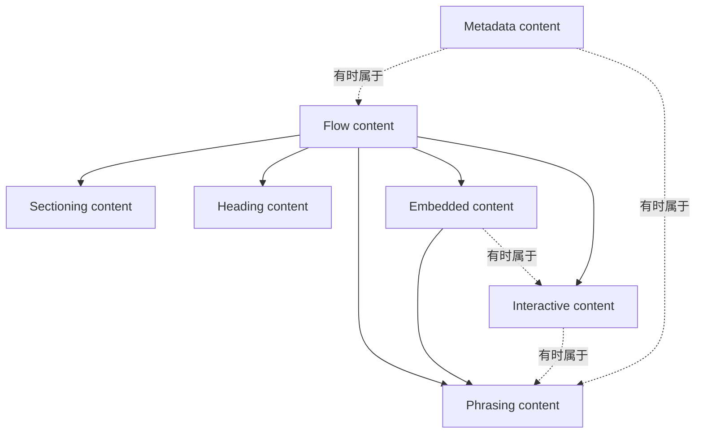

很多人学 HTML，都是从记标签开始：`div`、`span`、`p`、`a`、`img`，先背一堆名字，再照着页面往里填。这样学，入门当然没问题；但只要一碰到语义化、可访问性、表单、SEO、浏览器解析规则，脑子很快就会乱。因为你会发现，HTML 真正难的地方从来不是“有多少标签”，而是**这些标签为什么存在，它们各自代表什么，以及它们为什么不能随便互相嵌套**。这其实正是 WHATWG 对 HTML 的定义方式：元素和属性都是带语义的，浏览器、搜索引擎和其他处理器会依赖这层语义去理解文档。

## 一、HTML 到底是什么

如果只用一句话概括，更准确的定义是：**一种用来描述内容结构与含义的标记语言**，而不是“用来画页面的东西”。WHATWG 在规范背景部分写得很清楚：HTML 最初是为了“语义化描述科学文档”而设计的，后来才逐步扩展到各种文档与应用。它今天之所以还能立得住，也恰恰不是因为它会布局，而是因为它能稳定地表达“这里是标题、这里是段落、这里是导航、这里是表单、这里是文章主体”。

如果把时间线拉长一点看，这件事会更清楚。HTML 不是凭空掉下来的。1980 年，Tim Berners-Lee 在 CERN 写过 ENQUIRE；1989 年，他提出了 World Wide Web 设想；1990 年写出了最早的 Web 客户端和服务器。之后 HTML 经历了 HTML 4、HTML 4.01、HTML5 等阶段，再逐步走到今天由 WHATWG 维护的 Living Standard。Living Standard 的意义不是“名字更新潮”，而是规范不再靠几年一个大版本冻结发布，而是持续修订、持续校正、持续吸收实现经验。

## 二、元素、标签、属性，为什么不能混着说

很多时候我们会把“元素”和“标签”混着说，但规范层面它们并不是一回事。标签是源码里的语法边界，元素是 DOM 和语义层面的结构单元。规范对 HTML 语法的说法是：标签用来界定元素的开始和结束；属性写在开始标签里，具有名字和值。比如下面这段：

```html
<a href="https://developer.mozilla.org/" target="_blank">打开 MDN</a>
```

这里的 `<a>` 和 `</a>` 是标签，`href` 与 `target` 是属性，而整个 `a` 元素真正表达的是“一个链接”。规范甚至还会进一步约束属性值的合法性：像 `href` 这类值，必须是可以被解析的 URL；像 `disabled` 这类布尔属性，正确表达真值的方法通常是“出现它”，而不是写成 `disabled="true"`。

此外，根据 WHATWG HTML 规范和 MDN 的描述，属性（attribute）可以进一步细分为两类：**HTML 标记里有 content attributes，而 DOM 接口上定义了对应的 IDL attributes；二者常常通过 reflection 机制关联，但不是同一个层面的东西。**

写在标记里的 content attribute 以文本形式出现；但它们在规范里的解释方式并不都一样。像 `disabled`、`checked` 这类布尔属性，真正表达真值的关键不是某个字符串字面量，而是它是否出现。相对的，IDL attribute 则是浏览器解析完 HTML 构建成 DOM 树后，暴露给 JavaScript 调用的对象属性，它们可以是布尔值、数字、字符串甚至对象。

这两者通常是通过一种叫**反射（reflection）**的机制互相映射的，比如你用 JS 改了元素的 `id` IDL attribute，对应的 `id` content attribute 也会跟着变。但它们并不总是完全一致。最经典的命名差异就是写在 HTML 里的 `class`，在 JS 获取的 IDL 属性里叫 `className`；`for` 属性对应的则是 `htmlFor`。

**而在含义与同步上的差异，最典型的例子是表单控件：**

对于 `<input>` 来说，写在 HTML 里的 `value="123"`（content attribute）定义的是输入框的**初始默认值**（对应 IDL 的 `defaultValue`）；而你用 JS 读到的 `input.value`（IDL attribute）才是用户交互后的**当前真实值**。

这种 Content Attribute 与 IDL Attribute 的反射与差异机制，其实揭示了前端开发中一个极其核心的真相：**你写的 HTML 源码（Source Code）和浏览器里实际运行的 DOM 根本不是一回事。**

很多新手觉得 HTML 就是“一堆写在文件里的文本标记”，但实际上，HTML 源码只是一串用来描述界面**初始状态**的字符串序列；而 DOM 则是浏览器根据这串字符串，经过标准解析算法构建出来的**活的内存对象树**。content attribute 更接近文档标记里的初始声明；IDL attribute 则是浏览器在运行时暴露出来的接口和状态入口。两者经常相互映射，但并不总是等价。把 HTML 只当成静态文本去写，和把它看成浏览器会解析、修正并继续运行的一套结构声明，已经是两种完全不同的理解方式了。

还有一个很容易被忽略的点是：HTML 里标签名大小写不敏感，所以 `<TITLE>` 理论上也成立。但“能跑”不等于“应该这么写”。规范只是说它能被这样解析，不代表这是一种值得保留的现代写法。今天统一用小写，本质上不是审美问题，而是为了可读性、协作和工具链稳定。

## 三、空元素不是“自闭合标签”

在日常交流中，我们经常把 `img`、`br` 这类元素顺手叫成“自闭合标签”。但从规范的视角来看，这个说法其实并不准确，甚至容易带来心智模型上的偏差。WHATWG 的定义是 **void element**：它们只有开始标签，没有结束标签。注意，这和 XML/XHTML 那套“自闭合语法”不是一回事。

所以在 HTML 里：

```html

```

末尾那个 `/` 并不会让 `img` “闭合得更彻底”。规范直接说了：对 void element 来说，这个斜杠没有任何效果；只有放到 SVG、MathML 这种 foreign elements 里，它才表示 self-closing。也就是说，很多人从 JSX、XHTML、模板语言里带来的“自闭合心智”，放回原生 HTML 里其实并不准确。

## 四、标准文档结构为什么长这样

现代编辑器生成的 HTML 骨架看起来很像一套固定模板，其实每一层都有非常明确的语义分工。

```html
<!doctype html>
<html lang="zh-CN">
  <head>
    <meta charset="UTF-8" />
    <title>HTML 结构</title>
  </head>
  <body>
    ...
  </body>
</html>
```

`html` 是根元素，内容模型就是“一个 `head` 后跟一个 `body`”；规范还明确建议在根元素上写 `lang`，因为它会帮助语音合成和翻译工具判断语言。`head` 代表文档元数据集合，里面通常需要一个 `title`；而 `title` 不是拿来凑格式的，它应该在历史记录、书签、搜索结果这类脱离正文上下文的地方仍然说得清页面是什么。`body` 代表的，才是文档真正的内容。

因此，将 HTML 基础结构理解为“开局固定写法”并不准确。更专业的视角是：这不是模板，而是**文档根部的规范约束**。你不是为了满足编辑器才写 `head` 和 `body`，而是在明确告诉浏览器：哪些信息是元数据，哪些才是正文。

## 五、真正限制你乱嵌套的，不是经验，而是内容模型

HTML 最容易被低估的一层，就是 content model。WHATWG 说得很直接：每个元素都有自己的内容模型，元素的子节点必须匹配它的要求。换句话说，HTML 从来就不是“只要浏览器能显示就行”，而是“这个结构本身成不成立”。

HTML 内容模型的关键，不在“块级/行内”这种早年教学上的粗分法，而在 WHATWG 现在使用的一组类别：metadata、flow、sectioning、heading、phrasing、embedded、interactive 等。



除了上述的常规类别外，WHATWG 规范和 MDN 文档还定义了一种非常特殊的内容模型：**透明内容模型（Transparent content model）**。

MDN 对它的解释非常形象：如果一个元素的内容模型是“透明的”，这就意味着当它包含子元素时，这些子元素必须能够在该透明元素的**父元素**中合法存在。换句话说，这个透明元素在结构验证时就像是“隐形”的，它本身不施加独立的结构限制，它能装什么，完全继承并取决于它的父级模型。

最经典的透明模型代表就是 `<a>`、`<ins>`、`<del>` 标签。
以 `<a>` 标签为例：
- 如果 `<a>` 被包裹在 `<body>` 或 `<div>` 中，因为父级允许流内容（flow content），那么 `<a>` 内部也可以放 `<div>` 或 `<section>`。这就是为什么今天用一个大 `<a>` 标签去包裹一整个商品块结构是完全合规的。
- 但如果 `<a>` 被包裹在一个 `<p>` 段落里，因为 `<p>` 只能接受文字级的短语内容（phrasing content），这时候 `<a>` 里面如果再放一个块级的 `<div>`，整个结构就会因为突破了父级 `<p>` 的限制而变得不合法，导致 DOM 树解析时被浏览器强制修正。

当然，需要提醒的是，`<a>` 虽然是透明内容模型，但这并不意味着它“什么都能包”。规范同时还限制了它不能包含交互性后代（interactive descendants，比如 `<button>`），也不能嵌套另一个 `<a>` 标签。

拿 `p` 来说，规范给它的内容模型就是 **phrasing content**。这意味着段落里应该放的是文字级内容，而不是 `div`、`form`、`ul`、`table` 这种结构块。最能说明问题的例子，其实是规范自己给的这个片段：

```html
<p>Welcome. <form><label>Name:</label> <input></form>
```

规范明确说明：这样写不会得到“一个内部带表单的段落”；浏览器在解析到 `form` 开始标签时，会先把前面的 `p` 结束掉。也就是说，出问题的不是样式，而是**你以为自己写的是一棵树，浏览器实际构出来的是另一棵树**。这其实也再次印证了第二节里提到的核心结论：你写的源码字符串，与最终活在内存里的 DOM 树结构完全不是一回事。

表格是另一个高频坑：

```html
<table>
  <tr><td>1</td></tr>
</table>
```

很多人看到它“显示正常”，就以为源码和 DOM 结构完全一致。更准确地说，这种写法在 HTML 中可以成立，因为 `tbody` 的标签允许省略；但浏览器在解析后，通常仍会在 DOM 树中体现出一个 `tbody`。所以你在源码里看不到 `tbody`，不代表浏览器实际构建出来的树里没有它。这个差异，恰恰说明 HTML 的学习不能停留在源码表面。

## 六、常见元素速查表

这里整理了一份常见元素在内容模型与语义上的高频坑：

| 元素 | 允许内容或语义 | 常见误用 | 浏览器修正或实际后果 |
|---|---|---|---|
| `p` | 表示段落；内容模型是 **phrasing content**。 | 在里面放 `div`、`form`、`ul`、`table`。 | 解析时会在这些元素前**隐式结束 `p`**，DOM 与源码视觉直觉不一致。 |
| `div` | 没有特殊语义，本质上“表示其子内容”；是最后兜底容器。 | 用 `div` 代替 `article`/`nav`/`section`/`header`。 | DOM 通常不会自动修正；问题主要体现在语义丢失、无障碍与维护成本上升。 |
| `a` | 在 flow/phrasing 中都可用；内容模型是 **transparent**，但不能有 interactive descendant、`a` descendant 或显式 `tabindex` 后代。 | `<a><button>...</button></a>`、嵌套链接。 | 浏览器常仍会渲染，但交互语义冲突，点击与可访问性表现容易混乱。 |
| `span` | 常作为文本级包装器使用，处于 phrasing content 范围。 | 把它当按钮、标签页、开关来用。 | DOM 通常不修正；但天然缺少正确控件语义，往往还得补键盘与 ARIA。 |
| `img` | void element；无结束标签；也是 embedded/phrasing 内容。 | 把 `` 当 XHTML 式“自闭合语义”，或忽略 `alt`。 | 在 HTML 里 `/` **没有自闭合作用**；重要的是为图像提供合适替代文本。 |
| `form` | 参与 flow content；不该出现在只接受 phrasing 的位置。 | 放进 `p`，或把表单仅当样式容器。 | 放在 `p` 里会提前闭合段落；表单边界与表单关联规则也会随解析结果变化。 |
| `button` | phrasing content，但**不能有 interactive descendants** 与显式 `tabindex` 后代。 | 在按钮里再塞链接、输入控件。 | 常能渲染，但会造成交互层级冲突；从语义到可访问性都不成立。 |
| `ul`/`ol`/`li` | 列表用来承载列表项；`ul`、`ol` 不是 `p` 的合法子项。 | 想把“一个逻辑段落里的项目符号”直接塞进 `p`。 | 浏览器会把 `p` 提前结束；看上去是一段，结构上其实已被切开。 |
| `section`/`article`/`nav` | `section` 是主题性分区；`article` 是可独立分发/复用的完整单元；`nav` 是主要导航区块。 | 把 `section` 当纯样式容器，或把任何链接堆都包进 `nav`。 | DOM 通常不修正；但会让页面轮廓、地标与辅助技术理解失真。`nav` 还会被某些用户代理用来决定跳过或快速定位导航。 |
| `header`/`footer` | 分别表示引导性/导航性头部信息与最近 sectioning ancestor 的页脚；二者**都不是** sectioning content。 | 误以为它们天然“开启新 section”，或在里面再套 `header`/`footer`。 | 浏览器会照样渲染，但文档轮廓与 landmark 语义会偏离作者预期；规范也禁止其互相嵌套后代。 |

## 七、最佳实践清单

- 第一行始终写 `<!doctype html>`，而且放在真正的文档开头；现代标准已经明确，这个 doctype 的唯一现实作用就是稳定地触发 no-quirks。更复杂的旧 doctype 没有正当收益，反而可能触发 limited-quirks 或 quirks；`about:legacy-compat` 只在某些 XML 工具链兼容场景下才值得提。
- 在根 `html` 元素上显式写 `lang`。这不是“锦上添花”，而是规范直接写出来、会影响语音合成与翻译工具判断的元信息。
- `head` 里把 `title` 当成“脱离上下文也看得懂的文档名”去写，而不是把首屏文案机械复制过去；如果用 `meta charset` 声明编码，它应出现在文档前 1024 字节内。
- 把 `div`/`span` 当最后手段，而不是默认手段。能用 `article`、`section`、`nav`、`header`、`footer`、`button`、`label` 的地方，就不要先写一个无语义容器再靠 class 补意义。
- 不要把 XHTML 的“自闭合习惯”直接带进 HTML 心智模型。`` 在 HTML 里不是“更标准”，只是多了个无效果的斜杠；真正关键的是这个元素是不是 void、内容模型是不是 nothing。
- 遇到 `p`、列表、表格、表单这些结构，一定同时看**源码**和**浏览器里的实际 DOM**。如果布局怎么都对不上，先检查是不是解析恢复导致树被改写，再看 `document.compatMode`、Firefox 控制台告警或 Chrome Issues/Lighthouse。
- 语义化有价值，但不要神话它的 SEO 效果。对搜索引擎来说，语义 HTML 能帮助内容组织与技术质量；但像标题层级顺序，并不是神奇排名信号。真正应优先关注的是：正确语义、清晰内容、可抓取、可访问。

---

## 参考资料

1. [HTML Standard: Introduction](https://html.spec.whatwg.org/multipage/introduction.html)
2. [HTML Standard: Common microsyntaxes (Boolean attributes)](https://html.spec.whatwg.org/multipage/common-microsyntaxes.html#boolean-attributes)
3. [HTML Standard: Semantics, structure, and APIs of HTML documents](https://html.spec.whatwg.org/multipage/semantics.html)
4. [HTML Standard: Common DOM interfaces](https://html.spec.whatwg.org/multipage/common-dom-interfaces.html)
5. [HTML Standard: Grouping content (The p element)](https://html.spec.whatwg.org/multipage/grouping-content.html)
6. [HTML Standard: Text-level semantics (The a element)](https://html.spec.whatwg.org/multipage/text-level-semantics.html)
7. [HTML Standard: Form elements](https://html.spec.whatwg.org/multipage/form-elements.html)
8. [HTML Standard: Tabular data (The tbody element)](https://html.spec.whatwg.org/multipage/tables.html)
9. [Content categories - HTML | MDN](https://developer.mozilla.org/en-US/docs/Web/HTML/Content_categories)
10. [Anatomy of the DOM - MDN](https://developer.mozilla.org/en-US/docs/Web/API/Document_Object_Model/Anatomy_of_the_DOM)
11. [Void element - MDN Web Docs Glossary](https://developer.mozilla.org/en-US/docs/Glossary/Void_element)