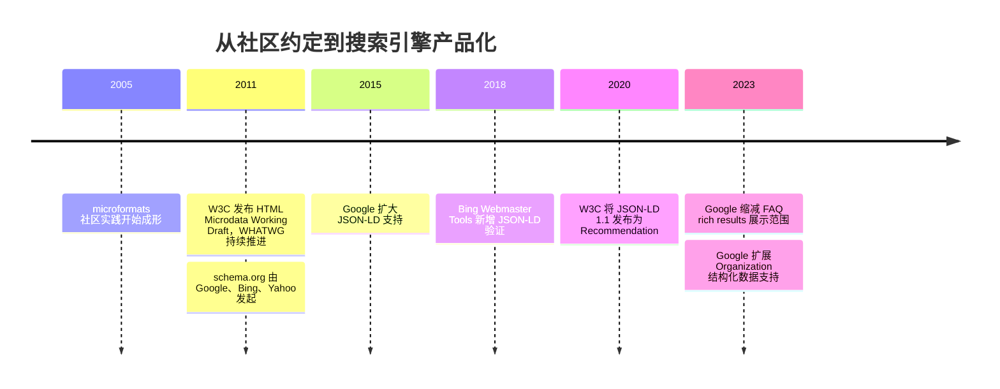
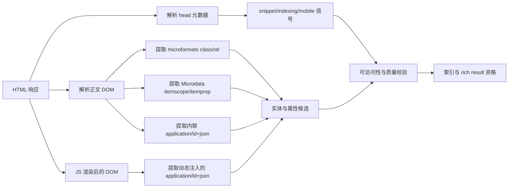

在前端开发与搜索引擎优化（SEO）的交汇处，“语义化”始终是一个核心议题。但我后来慢慢意识到，这一块最容易写散的地方，并不是某个 `itemprop` 或 `@type` 拼错了，而是把 **WHATWG**（Web 标准社区）、**W3C**、**schema.org**（结构化数据词汇表）、**Google/Bing**（搜索引擎）和 **MDN** 这几层材料混成了一层：

HTML 规范管语法和处理模型，词汇表管“你在说什么”，搜索引擎文档管“它认不认、怎么展示”。把这三层拆开以后，Microdata、microformats、JSON-LD、`<meta>` 的边界其实很清楚。

---

## 一、执行摘要

如果你的目标是现代搜索引擎里的结构化数据，默认选择几乎都该是 **schema.org + JSON-LD**：它是 Google 当前推荐的格式，Bing 也在其 Markup Validator 中提供了官方验证支持，而且它把“数据层”和“展示层”分开，维护成本通常最低。

Microdata 不是不能用，它仍然是 Google 支持的格式，只是更容易和 DOM 模板绑死；microformats 更像是建立在 class/rel 约定上的社区生态，不是今天 Google rich results 的主支持格式；而 `<meta>` 则是另一个通道，它直接影响 snippet、索引控制和移动端视口，但它**不是**结构化数据的替代品。

真正和 SEO 结果更相关的，往往不是“你用了哪种语法”，而是三件事：

1. 有没有给搜索引擎支持的实体类型与必要字段。
2. 这些字段是否和页面可见内容一致。
3. 它最终有没有拿到 rich result 的展示资格。

Google 明确说结构化数据**不保证**展示 rich results；它也只会“有时”采用 `meta description` 生成摘要；至于 `meta keywords`，Google 公开说明它对排名和索引都没有作用。

---

## 二、先把概念放回规范里

如果按规范位置来分，这几样东西其实根本不在同一抽屉里。

- **`<meta>`**：在 WHATWG 的 `semantics.html` 里，被定义为文档级 name-value metadata 的入口；`description` 被明确写成“适合目录或搜索引擎使用的页面描述”，`keywords` 也还在标准名录里，但规范自己就提醒它长期被滥用，很多搜索引擎不会采纳。
- **Microdata**：则是 HTML Living Standard 的独立章节，核心是 `itemscope`、`itemtype`、`itemprop`、`itemref`、`itemid` 这些属性，用来把页面内容编码成 name-value 对。
- **JSON-LD**：并不是 HTML 原生语义元素，它借的是 `script` 的 **data block** 机制。HTML 只负责承载，真正的语义来自 W3C 的 JSON-LD 1.1 和 schema.org 词汇表。
- **microformats**：更特殊，它不是 WHATWG 的一章，而是一套建立在 `class`/`rel` 之上的社区约定。

这也是我觉得最值得分清的一点：**schema.org 不是语法，Microdata / RDFa / JSON-LD 才是承载语法；microformats 则基本是另一套词汇体系。** 如果把这点搞混，后面一讨论“该不该迁移 JSON-LD”，很容易变成鸡同鸭讲。



这条时间线里真正重要的不是年份本身，而是方向：社区先有 microformats，HTML 标准后来给了 Microdata，搜索引擎和 schema.org 再把“结构化数据”产品化，最后 JSON-LD 因为更适合工程协作，逐渐成了默认答案。

---

## 三、浏览器和爬虫到底看到了什么

**从浏览器视角看**，这三类方案并不等价。JSON-LD 所在的 `script` 元素“**does not represent content for the user**”，当 `type` 是非 JavaScript MIME type 时，它只是 data block，用户代理本身不会按页面内容去处理它；Microdata 和 microformats 则都贴在 DOM 上，前者靠 `itemscope`/`itemprop`，后者靠 `class`/`rel`，它们和可见 HTML 天然更靠近。

**从爬虫视角看**，Google 当前对 rich results 的支持格式只有 **JSON-LD、Microdata、RDFa**，而 Bing 的官方帮助页把 schema.org、RDFa、microdata、microformats 都列进了结构化标注范围；Bing 在 2018 年又把 JSON-LD 纳入自己的 Markup Validator。换句话说，**语法支持范围并不完全相同**，这也是为什么你不能只看 WHATWG 或 W3C，就直接推断“SEO 一定会怎样”。



Google 对 JavaScript 的态度其实比很多人想象里宽一点：只要结构化数据在它渲染页面时已经出现在 DOM 里，它就能处理；但它同时明确提醒，**动态生成的 Product 标记会让 Shopping crawls 更不稳定，尤其对价格和库存这类高频变化字段**。所以“CSR 能不能做”与“CSR 适不适合做商品结构化数据”不是一回事。

还有一个很容易忽略、但我觉得特别值得记住的细节：WHATWG 允许你在 Microdata 里用 `<meta itemprop>`、`<link itemprop>` 之类的方式提供值，规范甚至明确说，把值直接写在页面里，或用隐藏方式补充，对微数据语义本身没有差别；但 Google 的质量指南又明确要求，结构化数据要代表页面主要内容，不能标注用户看不到、或具有误导性的内容。**也就是说：规范允许，不等于搜索结果资格就允许。**

`<meta>` 这一层的现实也很像。WHATWG 仍然保留 `keywords` 这个标准名，但规范自己就承认很多搜索引擎不信它；Google 更直接，公开写明 `meta keywords` 对索引和排名“没有任何作用”。`description` 则相反：规范说它适合给搜索引擎目录使用，而 Google 说它**有时**会拿来生成 snippet，但是否采用取决于它认为这段摘要是不是比正文抽取更准确。再加上 `robots`、`googlebot`、`viewport` 这些元信息，你会发现 `<meta>` 更像“抓取与展示控制面板”，而不是实体建模工具。

---

## 四、怎么选更像工程问题

下面这张表不是“标准官方排名榜”，而是把规范、搜索引擎文档和工程维护成本压缩成一张决策表。

| 方案 | 可读性 | 易实现性 | 对搜索引擎支持度 | 对验证工具支持 | 对动态内容友好度 | 对无障碍影响 | 维护成本 |
| --- | --- | --- | --- | --- | --- | --- | --- |
| **microformats** | 对人最直观，代码贴着正文读 | 中 | Google rich results 弱；Bing/社区解析尚可 | 社区解析器、Bing Validator 更友好 | 低到中 | 基本中性，取决于底层 HTML 语义 | 中到高 |
| **RDFa** | 较重，属性丰富但存在学习成本 | 中下 | Google/Bing 支持；CMS 生态中较常见 | Rich Results Test、Schema Validator 可用 | 中 | 基本中性 | 中到高 |
| **Microdata** | 对模板作者尚可，对审查者一般 | 中 | Google/Bing 支持；Google 非首选 | Rich Results Test、Schema Validator 可用 | 中 | 基本中性，但隐藏值最容易和正文脱节 | 中 |
| **JSON-LD** | 对前端和 SEO 协作最清爽 | 高 | Google 推荐；Bing 支持成熟 | Rich Results Test、Schema Validator、Bing Validator | 高 | 对辅助技术几乎无直接帮助，也通常不破坏语义 | 低到中 |
| **`<meta>`** | 很直白 | 高 | 对 snippet、indexing、mobile 直接有效，但不是结构化数据 | 浏览器、搜索平台诊断工具都能看 | 高 | `viewport` 可能直接影响可访问性 | 低 |

如果只让我给一句建议，那就是：**默认用 JSON-LD；只有在模板受限、数据和可见 DOM 必须强绑定，或者你明确在做 microformats 生态时，才往回退。** 这几种方案的降级也都还算温和——不支持的浏览器或爬虫，大多只是忽略这些 class、属性或 data block，页面对用户本身还是可读的；真正该避免的，是让业务逻辑或页面可用性依赖 rich result 是否出现。

---

## 五、实战示例

### 1. 在 `<head>` 里放真正有用的 meta

```html
<head>
  <meta charset="utf-8" />
  <title>从“会写标签”到“理解 HTML 结构”</title>

  <meta
    name="description"
    content="一篇面向开发者的文章：重新理解 HTML 语义、结构化数据与 SEO 的边界。"
  />

  <meta
    name="robots"
    content="index,follow,max-snippet:-1,max-image-preview:large"
  />

  <meta
    name="viewport"
    content="width=device-width, initial-scale=1"
  />
</head>
```

爬虫最终看到的是**文档级信号**：`description` 可能参与 snippet 生成，`robots` 控制索引和摘要行为，`viewport` 影响移动端渲染提示；但它们不会像 schema.org 一样告诉搜索引擎“这是 Article / Product”。另外，`keywords` 虽然还在 WHATWG 标准名录里，Google 已明确说明不使用。

### 2. 用 microformats 标注文章

```html
<article class="h-entry">
  <h1 class="p-name">从“会写标签”到“理解 HTML 结构”</h1>
  <p>
    作者：<a class="p-author h-card" href="/about">某某</a>
    ·
    <time class="dt-published" datetime="2026-04-16T14:28:00+08:00">
      2026-04-16
    </time>
  </p>
  <p class="p-summary">不是标签大全，而是把 HTML 放回结构和语义里。</p>
  <div class="e-content">
    <p>正文……</p>
  </div>
</article>
```

它最大的优点是**人类读代码很舒服**，而且和正文贴得很近；缺点也很现实：从 Google 当前只把 JSON-LD、Microdata、RDFa 列为 rich results 支持格式这一点看，microformats 更适合社区协议、内容再分发或个人站点生态，而不是把富结果预期全压在它身上。

### 3. 用 Microdata 标注产品

```html
<section itemscope itemtype="https://schema.org/Product">
  <h1 itemprop="name">机械键盘 K87 Pro</h1>
  
  <p itemprop="description">热插拔、三模连接、PBT 键帽。</p>

  <div itemprop="brand" itemscope itemtype="https://schema.org/Brand">
    品牌：<span itemprop="name">KeyNorth</span>
  </div>

  <div itemprop="offers" itemscope itemtype="https://schema.org/Offer">
    <meta itemprop="priceCurrency" content="CNY" />
    价格：<span itemprop="price">499</span> 元
    <link itemprop="availability" href="https://schema.org/InStock" />
  </div>
</section>
```

爬虫这里看到的是和 DOM 强绑定的一组 name-value 对。它的优点是 **“显示什么、标什么”很自然** ；缺点是模板噪音会越来越重，而且像 `priceCurrency`、`availability` 这种通过 `<meta>` / `<link>` 给出的隐藏值，在规范层面没问题，但依然要和页面的可见内容保持一致，否则会撞上搜索引擎质量规则。

### 4. 用 RDFa 标注文章

```html
<article vocab="https://schema.org/" typeof="Article">
  <h1 property="headline">从“会写标签”到“理解 HTML 结构”</h1>
  <p>
    作者：<span property="author" typeof="Person"><span property="name">某某</span></span>
    ·
    <time property="datePublished" datetime="2026-04-16T14:28:00+08:00">2026-04-16</time>
  </p>
  <p property="description">不是标签大全，而是把 HTML 放回结构和语义里。</p>
</article>
```

RDFa（Resource Description Framework in Attributes）和 Microdata 思路类似，都是在 HTML 标签上加属性，但它的词汇表达更丰富（比如 `vocab`、`typeof`、`property`）。它的优点是**语义表达非常严谨**，不仅限于 schema.org，还能融合多种命名空间；缺点是**语法相对繁琐**，在现代前端组件化开发中较少被作为首选，但在 Drupal 等传统 CMS 系统中依然常见。Google 同样原生支持它。

### 5. 用 JSON-LD 标注文章

```html
<script type="application/ld+json">
{
  "@context": "https://schema.org",
  "@type": "BlogPosting",
  "headline": "从“会写标签”到“理解 HTML 结构”",
  "datePublished": "2026-04-16T14:28:00+08:00",
  "dateModified": "2026-04-16T14:28:00+08:00",
  "author": {
    "@type": "Person",
    "name": "某某"
  },
  "description": "一篇从结构、语义和规范理解 HTML 的文章。",
  "mainEntityOfPage": "https://example.com/posts/html-structure",
  "image": [
    "https://example.com/images/html-structure-cover.jpg"
  ]
}
</script>
```

爬虫最终看到的是一个独立的数据块，而不是散落在 DOM 各处的属性。它最大的优点是**展示层和数据层分离**，适合 SSR、SSG、CMS 插件和跨模板复用；代价则是，你必须主动约束它和正文一致，否则很容易出现“JSON-LD 是一套话，页面正文又是一套话”。

### 6. 用 JSON-LD 标注事件

```html
<script type="application/ld+json">
{
  "@context": "https://schema.org",
  "@type": "Event",
  "name": "前端语义化与结构化数据分享会",
  "startDate": "2026-05-10T19:30:00+08:00",
  "endDate": "2026-05-10T21:30:00+08:00",
  "eventAttendanceMode": "https://schema.org/OnlineEventAttendanceMode",
  "eventStatus": "https://schema.org/EventScheduled",
  "location": {
    "@type": "VirtualLocation",
    "url": "https://example.com/live"
  },
  "organizer": {
    "@type": "Organization",
    "name": "Example Dev Community"
  },
  "offers": {
    "@type": "Offer",
    "price": "0",
    "priceCurrency": "CNY",
    "availability": "https://schema.org/InStock",
    "url": "https://example.com/register"
  }
}
</script>
```

这类时间、地点、状态、票务信息很结构化，JSON-LD 往往会比 Microdata 更顺手，尤其当活动页有多个卡片组件、弹窗报名或前后端分离时更明显。

### 7. 用 JSON-LD 标注面包屑和组织

```html
<script type="application/ld+json">
[
  {
    "@context": "https://schema.org",
    "@type": "BreadcrumbList",
    "itemListElement": [
      {
        "@type": "ListItem",
        "position": 1,
        "name": "首页",
        "item": "https://example.com/"
      },
      {
        "@type": "ListItem",
        "position": 2,
        "name": "重学前端",
        "item": "https://example.com/frontend/"
      },
      {
        "@type": "ListItem",
        "position": 3,
        "name": "HTML 结构与语义",
        "item": "https://example.com/posts/html-structure"
      }
    ]
  },
  {
    "@context": "https://schema.org",
    "@type": "Organization",
    "name": "Example Studio",
    "url": "https://example.com",
    "logo": "https://example.com/logo.png",
    "sameAs": [
      "https://weibo.com/example",
      "https://www.zhihu.com/org/example"
    ]
  }
]
</script>
```

面包屑帮助搜索引擎理解层级，Organization 帮助它理解站点身份，但两者不应该“见缝就塞”。Google 对 Breadcrumb 强调的是站点层级，对 Organization 则明确建议放在首页或 About 一类单页上，而不是机械地每页全站复制。

### 8. 用 JSON-LD 标注 FAQ

```html
<script type="application/ld+json">
{
  "@context": "https://schema.org",
  "@type": "FAQPage",
  "mainEntity": [
    {
      "@type": "Question",
      "name": "JSON-LD 一定比 Microdata 更利于排名吗？",
      "acceptedAnswer": {
        "@type": "Answer",
        "text": "不一定。它更像是实现和维护优势，而不是天然排名加成。"
      }
    },
    {
      "@type": "Question",
      "name": "FAQ 标记现在还值得做吗？",
      "acceptedAnswer": {
        "@type": "Answer",
        "text": "如果你是健康或政府类权威站点，可以；普通站点别对 FAQ 富结果抱太高预期。"
      }
    }
  ]
}
</script>
```

这段代码语法没问题，但现实层面的重点不在“能不能写”，而在“现在还有没有展示机会”。Google 当前把 FAQ rich results 限制在健康和政府类、且公认权威的网站上。如果是用户可提交多答案的页面，应该用 `QAPage` 而不是 `FAQPage`。所以今天写 FAQ 标记，更应该把它看成结构化表达和内部治理，而不是普遍可得的 SERP 红利。

---

## 六、SEO 影响、误用与迁移

我现在更愿意把结构化数据的 SEO 价值理解成一句话：**它先影响“理解”和“展示资格”，再间接影响点击与流量；它不是一个可以单独抽出来许愿的排名按钮。**

Google 的官方表述一直很克制：结构化数据可以帮助它理解页面并触发 richer appearance，但并不保证展示 rich results。经验层面也很一致：把等价的 Microdata 换成 JSON-LD，本身未必带来自然流量提升；可一旦你真拿到了对用户有意义的富展示，CTR 或交互提升就有机会发生。SearchPilot 的对照测试也给了一个很有意思的补充：**“换语法”常常没效果，“让展示更丰富”有时才有效果。**

常见误用我反而觉得比“怎么写”更重要。最典型的几个坑是：

- 给页面没有展示的内容乱打标。
- 在同一实体上混用多种格式（旧的 schema.org 提醒为了避免解析混乱最好只选一种）。
- 把 FAQPage 用在可多用户回答的问答页。
- 给全站生成一模一样的 `meta description`，或继续维护 `meta keywords`。
- 在 `viewport` 里把 `user-scalable=no` 打开。
它们有的会直接影响 rich result 资格，有的会拖累 snippet 质量，有的则会伤害可访问性。

如果要从 Microdata 或 microformats 迁到 JSON-LD，我最推荐的路径不是“逐页手改”，而是先抽一层**规范化的领域对象**：文章页统一产出 `headline/datePublished/author`，商品页统一产出 `name/offers/brand`，然后在 SSR 或构建阶段把它们序列化成 JSON-LD。这样做的好处是，页面 UI 和结构化数据共享同一份源数据，不容易出现价格、日期两边不一致。Google 也明确建议，尽量从页面变量取值，避免复制数据导致 mismatch。

反过来，如果你要从 JSON-LD 回退到 Microdata 或 microformats，这种回退不是不行，但要更克制一些：Microdata 尽量少用 `itemref`，优先让属性跟着可见 DOM 走；microformats 则尽量复用现有语义元素，不要为了加类名把 HTML 结构弄得更糟。

按渲染方式看，我的建议会很直接：**SSR / SSG 优先，CSR 可以做但别滥用。**
文章、组织、面包屑这类相对稳定的数据，CSR 问题不大；价格、库存、活动状态这类高频字段，最好在首个 HTML 响应里就输出，或者至少走增量静态更新，而不是把正确性押给“爬虫刚好渲染到了最新状态”。

---

## 七、开发者清单

- 默认把 **schema.org + JSON-LD** 当作现代项目的起点；只有在模板受限、内容必须和 DOM 强绑定，或者你明确服务于 microformats 生态时，再考虑 Microdata / microformats。
- 让结构化数据和页面可见内容**同源生成**；不要为了省事在隐藏 `meta` 或脚本里再抄一份业务数据。规范允许隐藏值，不代表搜索引擎质量规则会放过不一致。
- 商品、库存、价格、活动时间这类高频字段，优先 SSR / SSG 首屏输出；CSR 能做，但别拿高频变化内容去赌渲染与抓取时序。
- `meta description` 写成**面向人的唯一摘要**；别再维护 `meta keywords`；`robots` 只在页面可被抓取时才有意义；`viewport` 不要禁用缩放。
- 发布前至少跑一遍 **Rich Results Test**、**Schema Markup Validator**，必要时再看 Bing 的验证工具和 URL Inspection，别只在本地“觉得自己写对了”。

---

## 参考资料

**官方规范与标准：**
1. [HTML Standard: The meta element](https://html.spec.whatwg.org/multipage/semantics.html#the-meta-element)
2. [HTML Standard: Microdata](https://html.spec.whatwg.org/multipage/microdata.html)
3. [HTML Standard: The script element (data block)](https://html.spec.whatwg.org/multipage/scripting.html#the-script-element)
4. [JSON-LD 1.1 - W3C Recommendation](https://www.w3.org/TR/json-ld11/)

**搜索引擎文档：**
5. [Intro to How Structured Data Markup Works | Google Search Central](https://developers.google.com/search/docs/appearance/structured-data/intro-structured-data)
6. [Mark Up FAQs with Structured Data | Google Search Central](https://developers.google.com/search/docs/appearance/structured-data/faqpage)
7. [Marking Up Your Site with Structured Data - Bing Webmaster Tools](https://www.bing.com/webmasters/help/marking-up-your-site-with-structured-data-3a93e731)
8. [Introducing JSON-LD Support in Bing Webmaster Tools (2018)](https://blogs.bing.com/webmaster/august-2018/Introducing-JSON-LD-Support-in-Bing-Webmaster-Tools)
