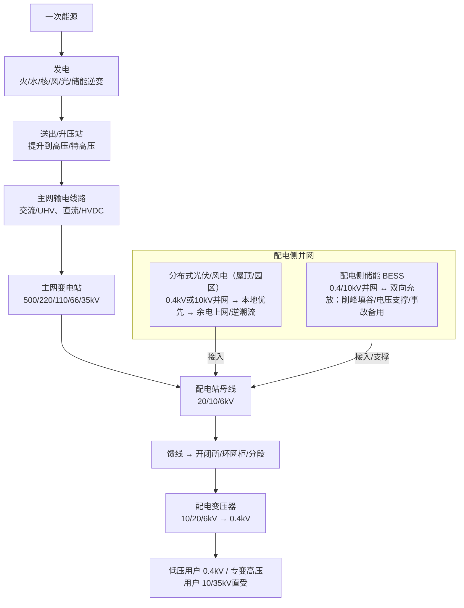

## 1. 电力系统总体架构



**要点：**

* “站-线-变-柜-表”是配网视角下常见对象链条。
* **母线**是站/柜内的“汇流节点”（不是线路）；**馈线**是母线对外出线。
* 专变（大工业/数据中心等）可在 10/35kV 直接受电。

---

## 2. 源-网-荷-储一图懂

```
[ 源 ] 发电与可再生+储能逆变
   → 供给有功/无功、调峰调频、出力不确定
        │
        ▼
[ 网 ] 输配电网络（站-线-变-开关-保护）
   → 容量/电压/潮流/继保/可靠性
        │
        ▼
[ 荷 ] 用电侧（居民/工商业/大工业/新型负荷）
   → 负荷曲线/峰谷/弹性与需求响应
        ▲
        │
[ 储 ] 储能（抽蓄/电化学/V2G等）
   → 吸收富余/削峰填谷/支撑电压与频率
```

| 角色         | 定义          | 典型对象                    | 关键指标                   | 常见控制/约束                  |
| ---------- | ----------- | ----------------------- | ---------------------- | ------------------------ |
| 源（Source）  | 发电与可注入功率的资源 | 火电、水电、核电、风电、光伏、储能放电、V2G | 有功 P、爬坡率、最小技术出力、出力预测误差 | AGC/调频、出力限额、并网规范、功率因数    |
| 网（Grid）    | 输配电网络       | 线路、变电站、母线、馈线、配变、环网柜     | 载流率、潮流、短路电流、电压合格率、线损   | N-1、继保定值、AVC 无功电压控制、区段限额 |
| 荷（Load）    | 用电需求        | 居民、工商业、大工业、充电桩          | 负荷曲线、峰谷差、功率因数、需量       | 需求响应、错峰、合同需量、容量电价        |
| 储（Storage） | 可双向调节的“缓冲器” | 抽蓄、电池储能、热储能、车网互动        | 充/放功率、SOC、往返效率、时长 h    | 调峰/调频、削峰填谷、黑启动、备用        |

---

## 3. 分布式并网典型拓扑（含双向计量/逆潮流）

```
   10kV馈线 ──→ 环网柜/开闭所 ──→ 配变(10/0.4kV) ──→ 台区低压母线
                                                       │
                                          ┌────────────┴────────────┐
                                          │                         │
                                   用户表（正/反向）          屋顶光伏+并网逆变
                                          │                         │
                                          └─────── 双向潮流 ────────┘
说明：晴天中午光伏>本地负荷 → 低压侧出现反向功率 → 经配变向上“顶电压/逆潮流”
```

---

## 4. 关键术语速查（中英对照）

| 术语      | 英文                              | 一句话解释                       |
| ------- | ------------------------------- | --------------------------- |
| 母线      | Busbar                          | 站/柜内同电压的“汇流排”，是节点，**不是**线路  |
| 馈线      | Feeder                          | 从配电母线引出的**对外线路**（10/20/6kV） |
| 配电站     | Distribution Substation         | 把高压降到中压，分配到多条馈线             |
| 配变      | Distribution Transformer        | 把中压降到0.4kV（台区变/箱变/杆上变）      |
| 逆潮流     | Reverse Power Flow              | 用户/台区向上级电网“倒送电”的现象          |
| 防孤岛     | Anti-Islanding                  | 外网失电时快速切离DG，防局部“带电孤岛”       |
| 无功      | Reactive Power (Q)              | 不做功但支撑电压（单位：kvar）           |
| 视在功率    | Apparent Power (S)              | S²=P²+Q²，单位：kVA             |
| 功率因数    | Power Factor (PF)               | PF=P/S，越高线路越省损耗             |
| AVC/AGC | Auto Voltage/Generation Control | 自动电压/出力控制                   |
| DMS     | Distribution Management System  | 配电网能量/故障/电压管理平台             |
| VPP     | Virtual Power Plant             | 聚合分布式源/储/荷统一调度的“虚拟电厂”       |

---

## 5. 单位与换算（常见误区加粗标注）

| 量纲    | 常见单位              | 含义                      | 换算/公式                 |
| ----- | ----------------- | ----------------------- | --------------------- |
| 功率    | W, kW, MW, GW     | 瞬时能量转换速率（电气有功，P）        | 1 kW = 1000 W         |
| 电能/电量 | Wh, kWh, MWh, GWh | 能量 = 功率 × 时间；计费常用       | 1 MWh = 1000 kWh      |
| 视在功率  | VA, kVA, MVA      | S = √(P² + Q²)，交流系统设备容量 | 1 kVA = 1000 VA       |
| 无功功率  | var, kvar, Mvar   | 交流磁场/电场能量往返（Q）          | 功率因数 PF = P / S       |
| 电压等级  | V, kV             | 电位差；常说 10 kV / 110 kV 等 | 1 kV = 1000 V         |
| 电流    | A, kA             | 电荷流动速率（I）               | 1 kA = 1000 A         |
| 频率    | Hz                | 交流每秒周期数；中国常用 50 Hz      | —                     |
| 能效/比率 | kWh/kW, kWh/m²·d  | 满发小时 / 比能产、辐照比等         | 满发小时 = 年发电量 / 装机 (kW) |


**功率 vs 电能**

* **功率（P）**：瞬时快慢 → **W、kW、MW、GW**
* **电能（E）**：累计多少 → **Wh、kWh、MWh、GWh**
* **常见误区**：**kW ≠ kWh**；**MW·h**写作**MWh**（不加点号）

**典型换算**

* 1 kW = 1000 W
* 1 MW = 1000 kW
* 1 kWh = 1000 Wh
* 年电量估算：平均功率(kW) × 时间(h) = kWh
  例：100 kW 连续运行 10 小时 → 1000 kWh = 1 MWh

**有功/无功/视在功率**

* P（kW）做有用功；Q（kvar）支撑电压；S（kVA）设备容量
* 三角关系：S² = P² + Q²；PF = P/S（常见目标 ≥ 0.9）

---

## 6. 电压等级与典型设施对照表

| 层级    | 常见电压                     | 典型设施             | 说明       |
| ----- | ------------------------ | ---------------- | -------- |
| 特/超高压 | ±800/1100kV DC；1000kV AC | 远距离输电通道          | 跨区大送出/互联 |
| 高压主网  | 500/220/110/66/35kV      | 主网变电站、输电线路       | 站-线-站输电，远距离/区域输电与分配  |
| 配电中压  | 20/10/6kV                | 配电站母线、馈线、环网柜、开闭所 | 城乡配网骨干   |
| 低压    | 0.4kV（单相0.23kV）          | 台区、居民/商服         | “最后一公里”  |
| 专变直受  | 10/35kV                  | 大工业/数据中心自建配电房    | 直接高压受电   |

---

## 7. 分布式并网：逆潮流与防护要点

* **就地消纳优先**：先满足本地负荷，富余再外送或**充电**到储能
* **逆潮流风险**：配变高电压、馈线段越限、继保配合受影响
* **常见治理：**

  1. 逆变器**无功/电压-无功下垂**支撑
  2. 储能**吸纳富余**（削峰）
  3. 动态无功补偿（SVG/STATCOM）、电容投切
  4. **逆功率保护**与**防孤岛**（失压/失频快速切离）
* **动作门限/时限**：以**当地并网规范或并网批复技术条款**为准（不同省网/场景参数不同）

---

## 8. 出力预测 vs 负荷预测（方法对照）

| 类别                     | 光伏/风电出力预测     | 负荷预测                    | 优势/短板          |
| ---------------------- | ------------- | ----------------------- | -------------- |
| 统计/时序（ARIMA/季节模型）      | 历史功率序列；晴天规律性好 | 短期滚动好；遇节假日/突发退化         | 简洁高效；难引入多因素    |
| 机器学习（SVM/RF/XGB）       | 气象+历史功率多变量拟合  | 气温/湿度/日类型等多特征建模         | 抗非线性；调参与数据依赖   |
| 深度学习（LSTM/Transformer） | 捕捉时序+非线性/不确定性 | 近年主流，精度高                | 算力与数据要求高，需防过拟合 |
| 混合/集成                  | 物理+数据驱动、残差校正  | ARIMA+LSTM 等叠加/Stacking | 抗异常、泛化更好；实现复杂  |

---